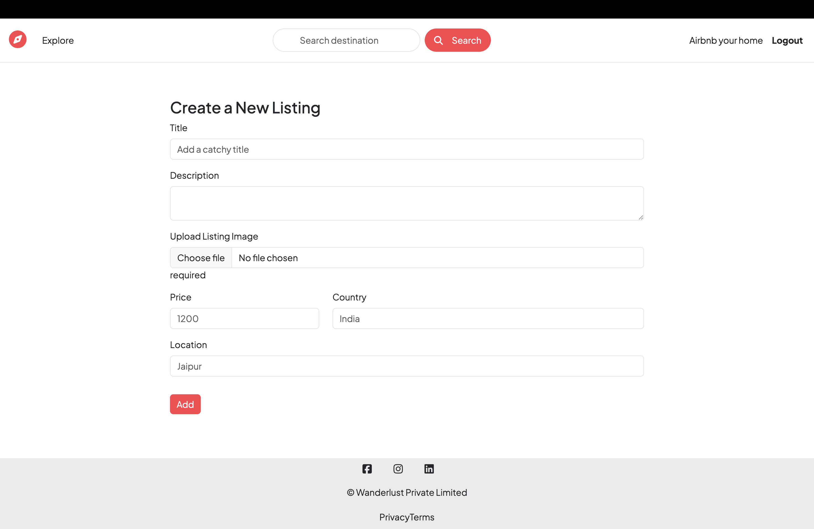
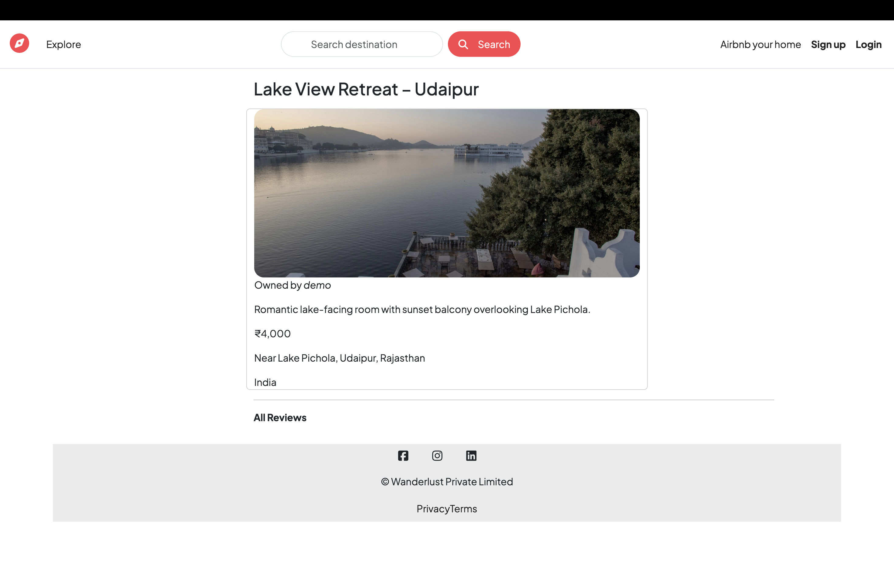

# 🌍 Wanderlust – Travel & Stay Booking Platform (Inspired by Airbnb)

Wanderlust is a full-stack travel accommodation platform inspired by Airbnb, enabling users to explore destinations, create property listings, upload images, and share reviews.

It is a backend-driven web application built using MVC architecture, demonstrating authentication, media storage, and scalable API design.

---

## 🎯 Problem Statement

Finding and managing travel accommodations online requires a seamless and secure platform. Wanderlust addresses this by allowing users to:

* Discover and explore travel listings
* Create and manage property listings
* Share experiences through reviews
* Upload and manage images efficiently

---

## 🚀 Live Application

🔗 https://wanderlustmajorproject-vozn.onrender.com

---

## 📸 Screenshots

> *(Add real screenshots in a `screenshots/` folder)*





---

## ✨ Key Features

* 🏡 Create, edit, and delete travel listings
* 🖼 Upload and manage images via Cloudinary
* 🔐 User authentication with Passport.js
* ⭐ Add and manage reviews for listings
* 🛡 Secure routes for authorized users
* ⚡ Server-side rendering using EJS
* 📱 Responsive UI using Bootstrap

---

## 🧠 Tech Stack

### Backend

* Node.js
* Express.js

### Database

* MongoDB Atlas
* Mongoose

### Frontend

* EJS (Embedded JavaScript Templates)
* Bootstrap
* HTML, CSS, JavaScript

### Authentication

* Passport.js
* Express Session

### Media Storage

* Cloudinary

### Tools

* REST APIs
* Git & GitHub

---

## 🏗️ System Architecture

The application follows the MVC pattern:

User → EJS Views → Express Routes → Controllers → MongoDB → Response → UI

* Routes handle incoming requests
* Controllers manage business logic
* Models interact with MongoDB
* Views render dynamic content

---

## 🔌 API Design Overview

* RESTful routes implemented for listings and reviews
* CRUD operations for listings and user-generated content
* Middleware used for authentication and authorization
* Server-side validation for data integrity

---

## 🧪 Testing & QA Approach

* Performed manual testing of all user flows
* Validated authentication and protected routes
* Tested edge cases:

  * Unauthorized access attempts
  * Invalid form inputs
  * Image upload failures
* Verified UI rendering across different pages
* Debugged routes and APIs using browser dev tools

---

## ⚠️ Challenges & Solutions

* **Authentication flow complexity** → Managed using Passport.js and sessions
* **Image upload handling** → Integrated Cloudinary for optimized storage
* **Route protection** → Implemented middleware for authorization
* **Database schema design** → Structured models for scalability

---

## 📂 Project Structure

```id="mvopx2"
Wanderlust/
│
├── models/          # Mongoose schemas
├── routes/          # Express routes
├── controllers/     # Business logic
├── views/           # EJS templates
├── public/          # Static assets
└── app.js
```

---

## ⚙️ Installation & Setup

### 1️⃣ Clone the Repository

```bash id="g37t3k"
git clone https://github.com/ayushhhkumar/WanderLustMajorProject.git
cd WanderLustMajorProject
```

---

### 2️⃣ Install Dependencies

```bash id="1nl21o"
npm install
```

---

### 3️⃣ Setup Environment Variables

Create a `.env` file:

```id="xmk22a"
ATLASDB_URL=your_mongodb_connection
CLOUDINARY_CLOUD_NAME=your_cloudinary_name
CLOUDINARY_KEY=your_cloudinary_key
CLOUDINARY_SECRET=your_cloudinary_secret
SECRET=session_secret
```

---

### 4️⃣ Run the Application

```bash id="2ysol2"
node app.js
# or
nodemon app.js
```

---

## 🚀 Deployment

The application is deployed using:

* Backend → Render Web Service
* Database → MongoDB Atlas
* Media Storage → Cloudinary

---

## 📚 Key Learnings

* Designed and implemented MVC architecture
* Built secure authentication systems
* Developed RESTful APIs for scalable applications
* Integrated third-party services like Cloudinary
* Improved debugging and testing practices

---

## 🔮 Future Improvements

* 📍 Google Maps integration for locations
* 🔍 Advanced search and filtering
* 📅 Booking and reservation system
* ⚡ Real-time availability updates
* 🎨 Enhanced UI/UX

---

## 👨‍💻 Author

**Ayush Kumar** <br/>
🔗 GitHub: https://github.com/ayushhhkumar <br/>
🔗 LinkedIn: https://www.linkedin.com/in/ayushhhkumar/

---

## ⭐ Support

If you found this project helpful, consider giving it a star ⭐ on GitHub!
